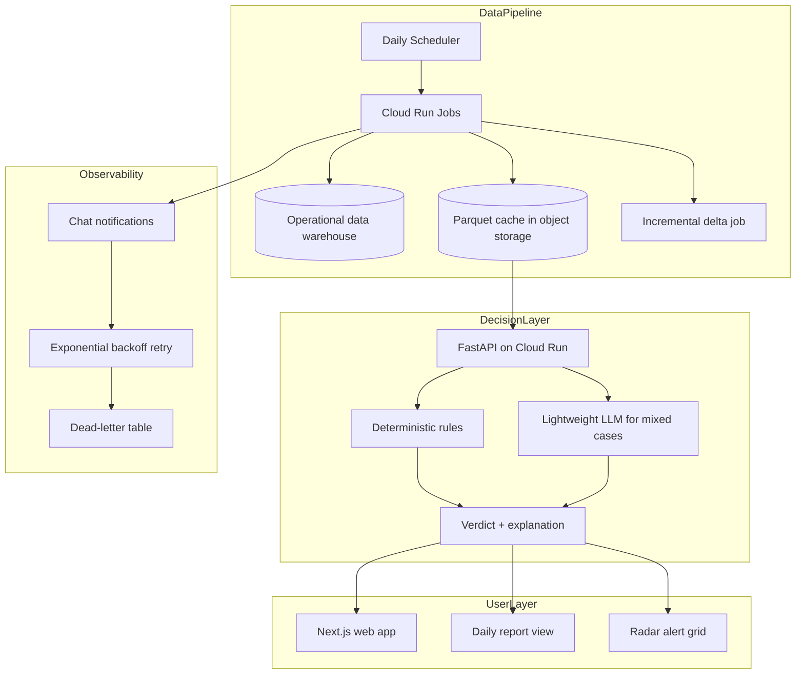

# Logistics Exception Radar

> Public case study — sanitized for portfolio use.  
> Production system source: private corporate repository.

---

## Problem

A national parcel network processes hundreds of thousands of active deliveries at any moment. Sometimes a delivery unit seems to disappear from tracking: the scanner does not register, the route is wrong, or the device is offline.

Investigators used to review these "missing-unit" incidents manually. They had no fast way to tell the difference between:

- A real loss or theft.
- A scanner that was forgotten or mistyped.
- A unit that was still moving but had not been scanned yet.
- A unit that had already been delivered under a different event.

The backlog grew, investigators were overwhelmed, and the target closure time was frequently missed.

---

## Solution

A platform that triages delivery exceptions automatically and gives investigators three tools:

1. **Single-shipment verdict lookup** — enter a shipment ID and get a probability and a short explanation: likely real incident, likely data error, or needs more tracking.
2. **Daily investigator report** — a pre-computed list of all open incidents with classifications, last-known tracking, and suggested actions.
3. **Radar alert panel** — a mass evaluation that scans the whole active-delivery universe and pushes alerts for clusters of suspicious patterns.

The platform separates deterministic cases from ambiguous ones. Deterministic rules handle most incidents in milliseconds. A lightweight language model reviews only the mixed cases.

---

## Architecture

---

## Technology stack

- **Frontend:** Next.js 16, React 19, TypeScript, Tailwind CSS v4, ShadCN/UI, Recharts
- **Backend API:** Python 3.11, FastAPI, pandas, pyarrow
- **Cache:** Parquet files in object storage with a 30-day lifecycle
- **Data source:** operational data warehouse
- **Compute:** Cloud Run Services and Jobs, Cloud Workflows, Cloud Scheduler
- **Authentication:** Firebase Authentication with Google sign-in
- **LLM for mixed cases:** Gemini Flash-Lite
- **Notifications:** chat notifications with retry and dead-letter table

---

## Key results

- Switching from on-demand warehouse queries to a daily Parquet cache reduced data-query cost by roughly 97 percent.
- The radar evaluates hundreds of thousands of active deliveries per batch.
- A taxonomy fix removed tens of thousands of false-positive alerts by preventing raw signals from overriding the final deterministic verdict.
- Local evaluation reaches around 80 shipment checks per second for deterministic cases.
- Ten-minute delta polls during business hours keep the API current without re-running the full batch.
- Investigators now start with a pre-classified list instead of a raw backlog.

---

## What makes the design interesting

1. **Deterministic-first triage.** Most incidents are resolved by explicit rules, not by a model. The LLM only sees the small subset where signals disagree.
2. **Parquet cache for scale.** Instead of querying the warehouse for every investigator click, the platform materializes the needed universe once per day into Parquet files. The API serves most requests from memory-backed pandas DataFrames.
3. **Incremental freshness.** Full batches are expensive, so the platform polls small deltas every ten minutes during operating hours.
4. **Taxonomy discipline.** Every tracking event belongs to a clear category. A fix in the classification logic removed a large share of false-positive alerts without changing the data.
5. **Three views for three jobs.** The same backend supports a quick lookup tool, a daily report for investigators, and a radar for proactive monitoring.
6. **Reliable notifications.** Job status is sent to a chat channel. If the chat call fails, the system retries with exponential backoff and writes persistent failures to a dead-letter table.

---

## What is not in this repository

- The real Python source code, parsers, or classification rules
- Real shipment IDs, depot names, route codes, or event taxonomies
- Data warehouse names, table names, or column names
- Cloud project IDs, service account keys, or API keys
- Webhook URLs for notifications
- Real frontend routes, URLs, or internal identifiers
- Production deployment configuration

---

## Assets

- [`assets/architecture.mmd`](assets/architecture.mmd) — Mermaid source for the architecture diagram above
- [`assets/dashboard-mockup.html`](assets/dashboard-mockup.html) — static HTML mockup of the radar dashboard
- [`assets/dashboard-mockup.png`](assets/dashboard-mockup.png) — exported PNG of the dashboard mockup

---

## Disclaimer

The actual production system is maintained in a private corporate repository. This public repository contains only a sanitized case study: problem description, generic architecture, technology stack, business impact, and illustrative mockups. No proprietary code or confidential information is included.
